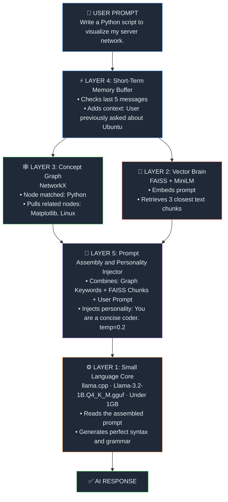

# Compositional-Artificial-Intelligence
### MSCP — Multi-System Compositional Pipeline

A **5-Layer local AI system** that runs entirely on CPU with no GPU required.
It beats cloud AI for private, domain-specific knowledge tasks by combining:

- **Layer 1** — Llama 3.2 1B (quantized, runs in <1GB RAM)
- **Layer 2** — FAISS vector database + MiniLM embeddings
- **Layer 3** — NetworkX concept graph with weighted edges
- **Layer 4** — Short-term rolling memory buffer (deque)
- **Layer 5** — Intelligent prompt assembler + persona injector

---
## How the 5 Layers Work Together


---

## 🗂️ Project Structure

```
mscp/
├── main.py                  ← The main chat loop (run this)
├── layer1_engine.py         ← LLM inference (llama.cpp)
├── layer2_vector.py         ← FAISS vector brain
├── layer3_graph.py          ← NetworkX concept graph
├── layer4_memory.py         ← Short-term memory buffer
├── layer5_assembler.py      ← Prompt assembler
├── setup.sh                 ← One-shot setup script
├── requirements.txt         ← Python dependencies
├── knowledge_base/          ← Drop .txt files here to teach the AI
│   └── python_reference.txt ← Sample knowledge (Python & Linux)
├── graph_data/              ← Auto-generated concept graph storage
├── models/                  ← Put your .gguf model file here
├── brain.index              ← Auto-generated FAISS index
└── brain_meta.pkl           ← Auto-generated FAISS metadata
```

---

## 🚀 Setup on GitHub Codespaces

### Step 1: Open in Codespaces
Click **Code → Codespaces → Create codespace** on this repo.

### Step 2: Run the setup script
```bash
chmod +x setup.sh
./setup.sh
```
This will:
- Create a Python virtual environment (`mscp_env/`)
- Install all dependencies
- Download the Llama 3.2 1B model (~700MB) from HuggingFace

### Step 3: Activate the environment
```bash
source mscp_env/bin/activate
```

### Step 4: Run MSCP
```bash
python main.py
```

---

## 🖐️ Manual Model Download (if setup.sh fails)

1. Go to: https://huggingface.co/bartowski/Llama-3.2-1B-Instruct-GGUF
2. Download: `Llama-3.2-1B-Instruct-Q4_K_M.gguf`
3. Place it in the `models/` folder

Or via terminal:
```bash
pip install huggingface_hub
python -c "
from huggingface_hub import hf_hub_download
hf_hub_download(
    repo_id='bartowski/Llama-3.2-1B-Instruct-GGUF',
    filename='Llama-3.2-1B-Instruct-Q4_K_M.gguf',
    local_dir='models'
)
"
```

---

## 💬 Chat Commands

| Command    | Description                                          |
|------------|------------------------------------------------------|
| `/graph`   | Visualize the concept graph → saves `concept_graph.png` |
| `/memory`  | Show the current short-term chat buffer              |
| `/ingest`  | Re-scan `knowledge_base/` for new `.txt` files       |
| `/clear`   | Clear the short-term memory buffer                   |
| `/help`    | Show all commands                                    |
| `/exit`    | Quit MSCP                                            |

---

## 📚 Teaching the AI New Knowledge

Drop any `.txt` file into the `knowledge_base/` folder, then type `/ingest`:

```bash
# Example: Add your server docs
echo "Server rack A contains: web1 (192.168.1.10), web2 (192.168.1.11)" > knowledge_base/servers.txt

# In MSCP chat:
/ingest
```

The AI will instantly know this — no retraining needed.

## ⚡ System Requirements

| Resource | Minimum    | Recommended |
|----------|------------|-------------|
| RAM      | 2 GB       | 4 GB        |
| Disk     | 2 GB       | 4 GB        |
| CPU      | Any x86_64 | 4+ cores    |
| GPU      | Not needed | Not needed  |

GitHub Codespaces free tier (4-core, 8GB RAM) works perfectly.

---

## 🔧 Customizing the Persona

Edit `layer5_assembler.py` and change `SYSTEM_PERSONA`:

```python
SYSTEM_PERSONA = """You are a senior DevOps engineer.
You specialize in Linux, Docker, and Kubernetes.
Always show complete commands with explanations."""
```

---

## 🧩 Adding a Bigger Model

For better quality, swap to a 3B model (needs ~3GB RAM):

1. Download `Llama-3.2-3B-Instruct-Q4_K_M.gguf` from HuggingFace
2. Place in `models/`
3. Edit `layer1_engine.py`:
```python
MODEL_FILE = "Llama-3.2-3B-Instruct-Q4_K_M.gguf"
```
